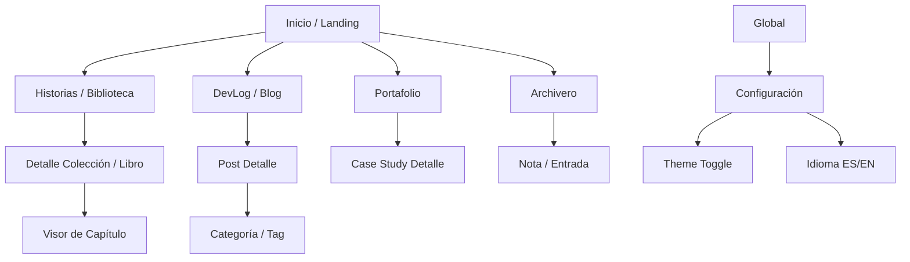
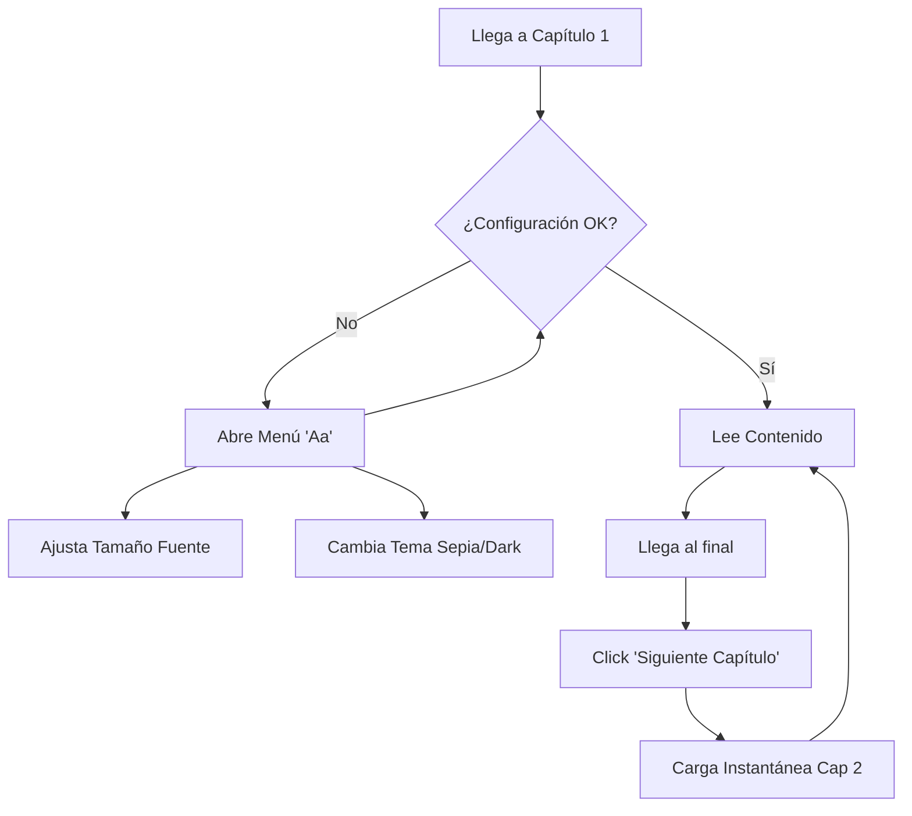

# UI/UX Specification: Joksan.dev Platform

**Date:** 27/11/2024
**Version:** 1.0
**Status:** Draft
**UI Library:** Shadcn-vue + Tailwind CSS

## 1\. Introduction

Este documento define los objetivos de experiencia de usuario, la arquitectura de información y las especificaciones visuales para **Joksan.dev**. Sirve como guía para la implementación del frontend en Nuxt 3, asegurando que la estética minimalista y profesional conviva armónicamente con la inmersión narrativa.

## 2\. Overall UX Goals & Principles

### Target User Personas

  * **El Lector Inmersivo:** Llega desde un enlace directo a un capítulo. Quiere leer sin distracciones, prefiere fondo oscuro por la noche y odia los tiempos de carga.
  * **El Reclutador Técnico:** Escanea la página de inicio y el portafolio en \<30 segundos buscando palabras clave (Vue, Nuxt, Arquitectura) y validación social (proyectos reales).
  * **El Colega Developer:** Busca soluciones en los DevLogs. Valora los bloques de código legibles y la navegación rápida.

### Design Principles

1.  **Content-First:** La UI (barras, botones) debe ser invisible o pasar a segundo plano, especialmente en las vistas de lectura (`/s/...`).
2.  **Tipografía como UI:** Al usar un diseño minimalista, la jerarquía visual se logra mediante pesos, tamaños y tipos de fuente, no con cajas o bordes innecesarios.
3.  **Movimiento Sutil:** Las transiciones de página (View Transitions API de Nuxt) deben ser suaves para mantener la sensación de "App Nativa".

## 3\. Information Architecture (IA)

### Sitemap / Screen Inventory

### Navigation Structure

  * **Primary Navigation (Desktop):** Navbar superior fijo (sticky) con fondo *backdrop-blur*. Logo a la izquierda, enlaces al centro/derecha.
  * **Primary Navigation (Mobile):** Menú hamburguesa que despliega un **Sheet (Shadcn)** lateral.
  * **Lectura (Chapter View):** La navegación principal se oculta al hacer scroll hacia abajo y reaparece al hacer scroll hacia arriba (patrón "Hide on scroll").

## 4\. User Flows

### The Reading Flow (Critical Path)

El flujo más importante para la retención de lectores.

## 5\. Component Library & Shadcn-vue Specs

Utilizaremos **Shadcn-vue** como base. Estos son los componentes primitivos que debemos instalar (`npx shadcn-vue@latest add ...`):

### Core Components

  * **Button:** Variantes `default`, `ghost` (para menú), `outline` (para tags).
  * **Sheet:** Para el menú móvil y paneles de configuración de lectura.
  * **Card:** Para los listados de Portafolio y DevLogs (con imagen de portada).
  * **Separator:** Para dividir secciones de contenido.
  * **Badge:** Para tecnologías (ej. "Vue", "Nuxt") y estados de historias ("En Progreso").
  * **ScrollArea:** Para bloques de código largos o listas de capítulos.
  * **Skeleton:** Para estados de carga (Loading states) mientras Storyblok responde.
  * **DropdownMenu:** Para el selector de idioma y tema.

### Custom "Compound" Components (A construir)

  * `StoryCard`: Composición de `Card` + Aspect Ratio vertical para portadas de libros.
  * `CodeBlock`: Wrapper sobre `ScrollArea` con resaltado de sintaxis (Shiki).
  * `ReaderLayout`: Un layout específico de Nuxt que elimina el Footer gigante y centra el texto en una columna estrecha (max-w-prose).

## 6\. Branding & Style Guide

### Color Palette

Usaremos la paleta **"Slate"** o **"Zinc"** de Tailwind (neutros fríos) para mantener la seriedad profesional.

  * **Primary:** `Slate-900` (Light) / `Slate-50` (Dark).
  * **Accent:** Un toque de color sutil (ej. `Indigo-500` o `Violet-500`) solo para enlaces interactivos y botones de llamada a la acción ("Suscribir").
  * **Background:** `White` (Light) / `Slate-950` (Dark) - *Evitar negro puro \#000 para reducir fatiga visual*.

### Typography

Uso de **@nuxt/fonts** para cargar fuentes optimizadas sin CLS (Cumulative Layout Shift).

  * **UI & Headings:** `Inter` o `Geist Sans` (Limpia, técnica, moderna).
  * **Prose (Historias):** `Merriweather` o `Lora` (Serifa clásica, excelente legibilidad en textos largos).
  * **Code:** `JetBrains Mono` o `Geist Mono`.

### Iconography

**Lucide Icons** (Nativo en Shadcn).

  * Estilo: Outline, stroke-width 1.5px (fino y elegante).

## 7\. Accessibility & Responsiveness

  * **Dark Mode:** Detección automática del sistema (`prefers-color-scheme`). Toggle manual persistente en `localStorage`.
  * **Touch Targets:** Todos los botones de navegación (Siguiente/Anterior) deben tener una altura mínima de 44px en móvil.
  * **Keyboard Nav:** El foco debe ser visible en todos los elementos interactivos (Shadcn lo maneja, pero hay que verificar contraste).

## 8\. Next Steps (Design Handoff)

1.  **Instalar Shadcn:** Ejecutar el init en el proyecto Nuxt.
2.  **Configurar Tailwind:** Definir las fuentes `sans` y `serif` en `tailwind.config.ts`.
3.  **Prototipar Layouts:** Crear `layouts/default.vue` y `layouts/reader.vue`.